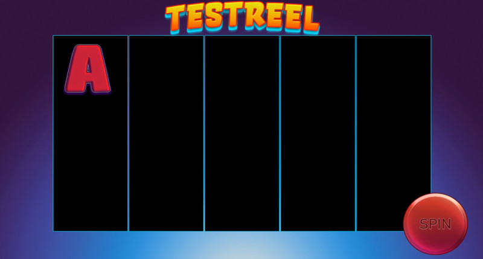

# Pixi.js Game-Boilerplate

## Description
This is a simple template/boilerplate for implementing a slot game using TypeScript 5.7 , Pixi 7.3 and GSAP 3.12.

## How it works
1. install Node.JS 22 (LTS)
2. clone this repo
3. run these scripts (defined in package.json)
   1. `npm run clean-setup`
   2. `npm run build`
   3. `npm run start`
4. now you should see the preset on your default-browser

### Screenshot

### Possible symbol-assets

## Documentations
- TypeScript https://www.typescriptlang.org/docs/
- PIXIJS - https://pixijs.download/v7.x/docs/index.html
- GSAP - https://gsap.com/docs/v3/GSAP/

## Commands

- `npm run setup` - install all npm libraries/dependencies
- `npm run clean-setup` - remove the node_modules-folder (if available) & install all npm libraries/dependencies
- `npm run build` - starts build procedure
- `npm run start` - start watching for files and open's server on localhost:8081
- `npm run lint` - generate code coverage report

